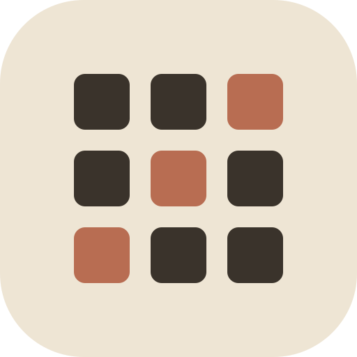

<div align="center">
  
  
  <br />
  <h1><strong>CLAIM / 05</strong></h1>
  <p><strong>A tactile, real-time multiplayer territory grid interface.</strong></p>

  <p>
    <a href="#features">Features</a> •
    <a href="#tech-stack">Tech Stack</a> •
    <a href="#quick-start">Quick Start</a>
  </p>
</div>

<br/>

> **CLAIM / 05** is a massive multiplayer grid-capture game built on top of WebSockets and Redis. Dive into a massive `5000x5000` coordinate space, stake your claim on the map, and watch the battlefield evolve in real-time as other players conquer adjacent territories.

---

## ✨ Features

- 🗺️ **Infinite Canvas**: A sprawling 5000x5000 board driven by high-performance canvas math.
- 🎯 **Tactile Gestures**: Pan smoothly with a two-finger scroll or swipe, and zoom seamlessly with Pinch-to-Zoom or `CTRL + Scroll`. Press `Space` or `Esc` to instantly snap back to your initial drop coordinate.
- 📡 **Sub-Millisecond Sync**: Instantaneous block capture and real-time state synchronization via a Go WebSocket server and Redis event streaming.
- 🎨 **Identity Hashing**: No hardcoded colors. Your unique identity acts as a cryptographic seed to generate a deterministic HSL color palette and a unique spawn coordinate far across the map.
- 🔋 **Stamina Economy**: Strategic gameplay! Capturing adjacent blocks costs 10 stamina, while distant captures cost 20. Stamina regenerates natively in the background.
- 🛰️ **Global Minimap HUD**: A sleek, full-screen blurred minimap for global navigation. Click anywhere to instantly teleport your viewport across the map.

## 🛠️ Tech Stack

<div align="center">
  <table>
    <tr>
      <td align="center"><strong>Frontend</strong></td>
      <td align="center"><strong>Backend</strong></td>
      <td align="center"><strong>State Layer</strong></td>
    </tr>
    <tr>
      <td align="center">Next.js App Router (React 18)</td>
      <td align="center">Golang (1.20+)</td>
      <td align="center">Redis (Key-Value & Pub/Sub)</td>
    </tr>
    <tr>
      <td align="center">Framer Motion</td>
      <td align="center">Gorilla WebSocket</td>
      <td align="center">go-redis/v9</td>
    </tr>
    <tr>
      <td align="center">Tailwind CSS</td>
      <td align="center">Concurrency primitives</td>
      <td align="center">Persistent Disk Dumps</td>
    </tr>
  </table>
</div>

## 🚀 Quick Start

Get your local cluster up and running in seconds.

### 1. Spin up the State Layer
You'll need Redis running locally to act as the single source of truth.
```bash
# MacOS via Homebrew
brew install redis
brew services start redis
```

### 2. Ignite the Go Backend
Boot the WebSocket engine that handles synchronization and broadcasting.
```bash
cd multiplayer-grid-backend
go mod tidy
go run .
# Server will start on :8080
```

### 3. Launch the Next.js Client
Start the tactile frontend interface.
```bash
cd multiplayer-grid-game
pnpm install
pnpm dev
# App will start on :3000
```

Open [http://localhost:3000](http://localhost:3000), enter your `GHOST_OP` designation, and start claiming your territory.

---

<div align="center">
  <p>Built with precision, chaos, and Go.</p>
</div>
